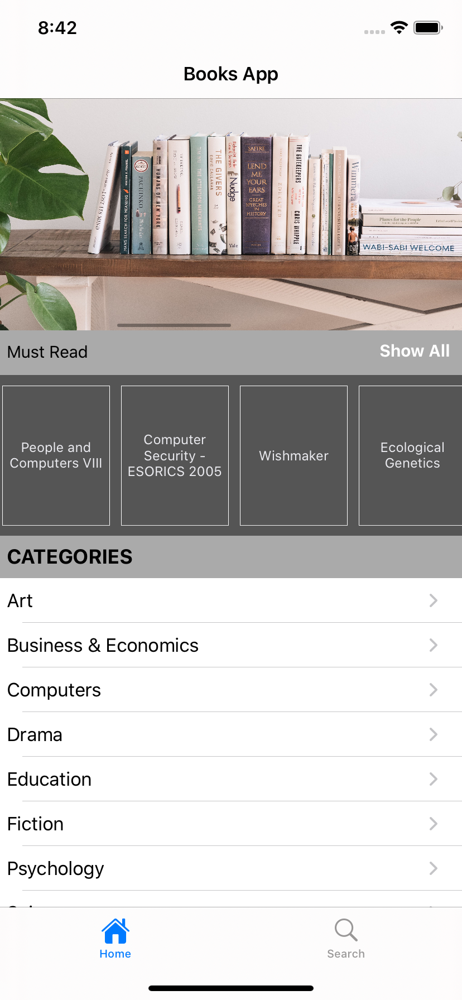
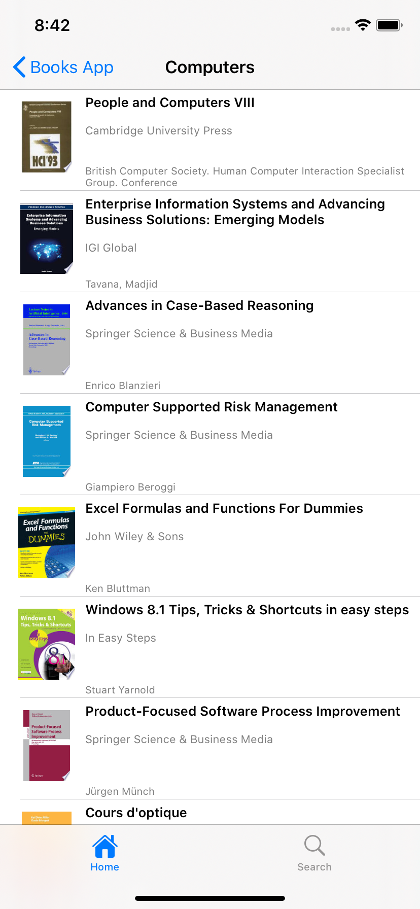
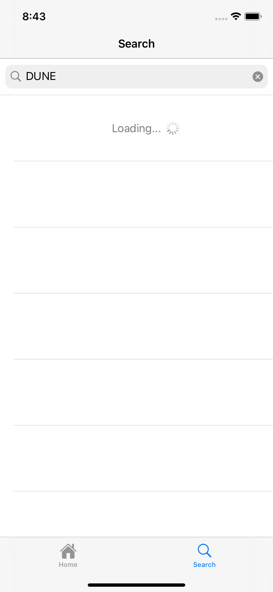
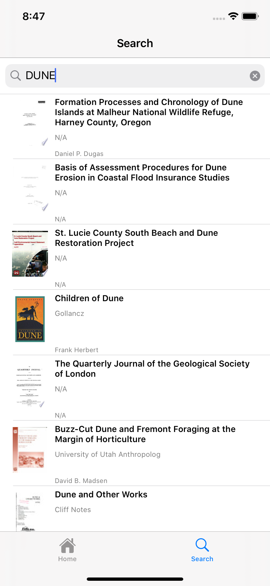
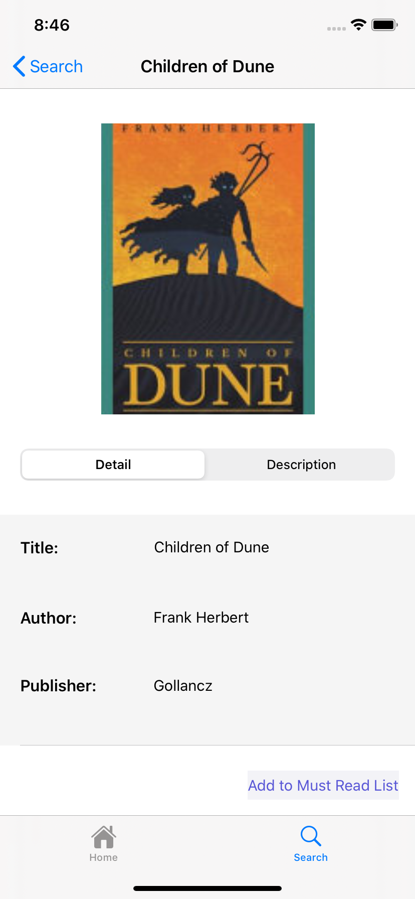
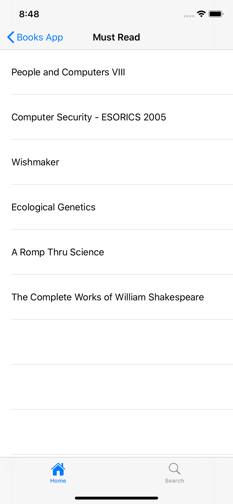

# BooksApp

### On my second iOS project, I used Google Books API. 

- I learned how to make URL requests, and JSON parsing with SwiftyJSON with this project. 
- I used xib files and storyboard together. 
- You can reach books from categories tables, also you can search for them. 
- The Book detail page has all the details about the book. 
- I wanted to learn how different Realm from Core Data, so I made an introduction to it. 
- You can click the 'add to must-read list' button and add this book's name to the Realm local database. 
- On the home page, there is a horizontal collection view that shows your must-read list. 
- With Show All button you can reach that list and delete them. They will be deleted from the database as well as the table view.

  
  
